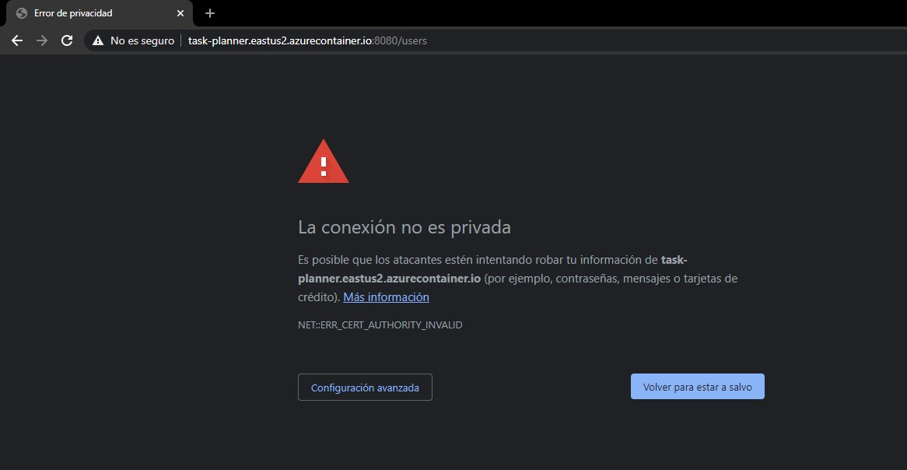
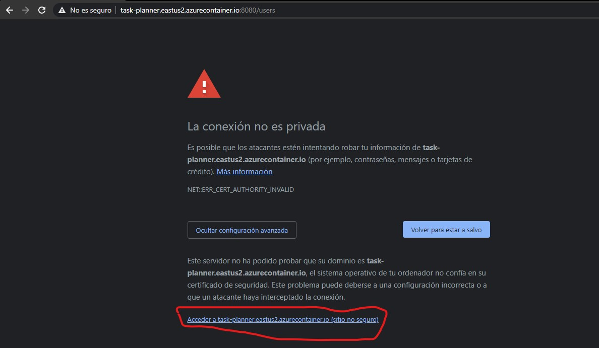

# IETI-LAB6
## Instrucciones para poder usar la aplicación front
1. Ingrese a la siguiente página web
[Azure Container Task Planner BackEnd](https://task-planner.eastus2.azurecontainer.io:8080/users)
2. Haga click en Configuración avanzada

3. Ahora click en Acceder a task-planner.eastus2.azurecontainer.io (sitio no seguro)

4. Acceda a las siguientes páginas donde se encuentra el front
[Front Firebase](https://users-listjmd.firebaseapp.com/)
[Front Firebase Web](https://users-listjmd.web.app/)

## Repositorios

[Repositorio FrontEnd](https://github.com/juanmd9/IETI-LAB6-FRONT)
[Repositorio Docker](https://hub.docker.com/repository/docker/juanmmd9/ieti-backend)